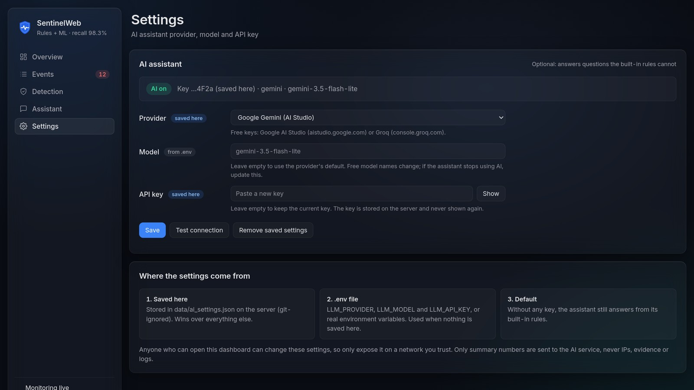
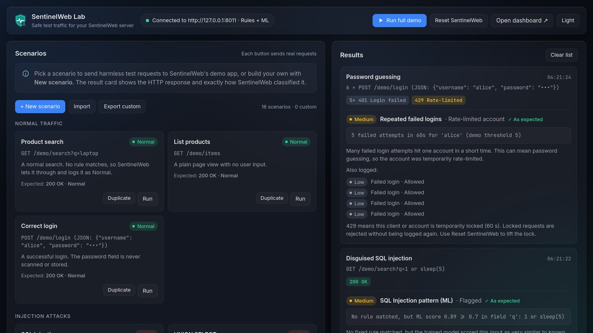
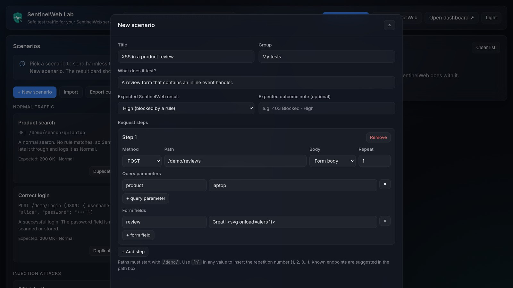

<p align="center"></p>

<h1 align="center">SentinelWeb</h1>

<p align="center"><b>Real-time web attack monitoring with rules + machine learning, explained in plain language.</b><br>
An educational prototype: <b>SentinelWeb</b> (the dashboard) protects a demo app, and <b>SentinelWeb Lab</b> (the client) sends safe test traffic to it.</p>

Monitors requests to a demo app, flags suspicious patterns with rules + a trained model,
and shows them on a dashboard. Use only on your own local demo. Never test sites you do not own.

| Product | What it does | Runs on |
|---|---|---|
| **SentinelWeb** (`dashboard/`) | Watches every request to its demo app, detects SQL injection, XSS, brute-force logins and request floods, blocks or flags them, and explains every alert | http://127.0.0.1:8000 |
| **SentinelWeb Lab** (`client/`) | Sends harmless test scenarios (built-in, from packs, or your own) and shows exactly how SentinelWeb classified each request | http://127.0.0.1:8001 |

**More docs:** [design diagrams](docs/design/README.md) · [presentation (4 min)](docs/ppt/SentinelWeb.pptx) · [demo video](docs/video/sentinelweb-demo.mp4) · [logo files](docs/brand/)

## Screenshots

**Overview**: threat level, live counters, activity over the last 5 minutes and the latest alerts.


**Event details**: evidence, a plain-language explanation and the ML score against the 0.70 threshold.


**Detection**: live model metrics, rules vs ML vs combined, and every rule with its severity and action.


**Assistant and Settings**: answers from rules first, with an optional AI model whose key can be added in the dashboard or in `.env`.



**SentinelWeb Lab**: run scenarios, build your own, and see each verdict.



**Light theme**: switch with the button in the sidebar; the choice is remembered.


## How it works

```
 SentinelWeb Lab (client/)              SentinelWeb (dashboard/)
 ┌─────────────────────┐   /demo/*   ┌────────────────────────────────────────────────────────┐
 │ scenarios (JSON) ──►│────────────►│ RequestMonitor ─► 1 locked? 2 rate 3 scan 4 logins      │
 │ runner + gateway    │             │      │                      │                            │
 │ results + verdicts ◄│◄── /api/* ──│      │ InputScanner (SQLi rules + ML model, XSS rules)     │
 └─────────────────────┘             │      ▼                                                   │
                                      │ EventRepository (SQLite) ─► /api/* ─► dashboard UI       │
                                      │ ChatAssistant: rules first, then Gemini / Groq (optional) │
                                      └────────────────────────────────────────────────────────┘
```

Every request to `/demo/*` passes four checks in order: **already locked?** → **request rate** →
**input scan** (query, nested JSON, form and text bodies, unusual URL paths) → **failed-login tracking**.
Only high-confidence rule matches are blocked; model-only detections are flagged for a human.
See [docs/design](docs/design/README.md) for architecture, class, sequence and other diagrams.

## Design diagrams

[docs/design](docs/design/README.md) has 14 diagrams for both products, grouped by type:

| Type | Diagrams |
|---|---|
| Architecture | system architecture, Docker deployment, front-end modules |
| Class | dashboard classes, Lab classes |
| Sequence | monitoring one request, Lab running a scenario, chat with AI fallback, saving an AI key, creating a custom scenario |
| Flow | detection pipeline (activity) |
| Functional | use cases |
| Data | entity-relationship model |
| State | rate-limit states |

- **View:** open [docs/design/README.md](docs/design/README.md) on GitHub (each diagram with a short explanation), or the
  images in `docs/design/images/<type>/` (`.png` for slides, `.svg` for the web).
- **Edit:** each diagram is a Mermaid text file in `docs/design/diagrams/<type>/`. GitHub shows `.mmd` files as diagrams;
  preview edits at https://mermaid.live or with a Mermaid extension for VS Code.
- **Re-render** after editing (needs Node.js), from `docs/design`:

      npx -p @mermaid-js/mermaid-cli mmdc -i diagrams/class/lab-classes.mmd -o images/class/lab-classes.svg
      npx -p @mermaid-js/mermaid-cli mmdc -i diagrams/class/lab-classes.mmd -o images/class/lab-classes.png -s 2

  A loop that re-renders every diagram is in [docs/design/README.md](docs/design/README.md#viewing-editing-and-re-rendering).

## Tech stack

| Layer | Technology | Used for |
|---|---|---|
| Language | **Python 3.10+** | Both products |
| Web framework | **FastAPI** + **Uvicorn** | APIs, the monitoring middleware, the demo app, the Lab server |
| Validation | **Pydantic** (comes with FastAPI) | Request bodies (chat, settings) |
| Detection | Python `re` (regular expressions) + sliding-window counters | SQL injection and XSS rules; brute-force login and request-flood detection |
| Machine learning | **scikit-learn** (TF-IDF on character 2–5-grams + logistic regression) | Scoring inputs for SQL injection |
| Data and model files | **pandas**, **joblib** | Cleaning the training data; saving and loading the trained model |
| Dataset | **SQLiV3.csv** (Kaggle) | Training and evaluating the model |
| Database | **SQLite** (Python's built-in `sqlite3`) | Event log, parameterized queries only |
| Frontend | **HTML, CSS and vanilla JavaScript (ES modules)** | Both UIs. No framework and no build step; charts are inline SVG |
| Fonts | **Inter**, **JetBrains Mono** (Google Fonts) | Typography |
| Optional AI | **Google Gemini** or **Groq**, called with Python's built-in `urllib` | Assistant answers when no rule matches |
| Packaging | **Docker** + Docker Compose | Running both products with one command |

Python packages to install are listed in `requirements.txt`: fastapi, uvicorn, scikit-learn, joblib and pandas.

## Project structure

```
main.py                  entry point: uvicorn main:app  (builds the app with dashboard.app.create_app)
dashboard/               SentinelWeb
  app.py                 application factory: creates and wires every component
  config.py              all settings and thresholds in one place, plus the .env loader
  detection/             rules.py, ml_model.py, detectors.py (strategy pattern), models.py, explanations.py
  monitoring/            middleware.py (the 4-step pipeline), request_inputs.py, rate_limiter.py
  storage/               event_repository.py (repository pattern over SQLite)
  assistant/             chat_assistant.py (facade), rule_responder.py, llm_providers.py (strategy), ai_settings.py
  api/                   dashboard_routes.py, assistant_routes.py, demo_routes.py
  web/                   index.html, css/, js/ (core, components, views), assets/logo.svg
client/                  SentinelWeb Lab
  app.py, __main__.py    entry points: python client/app.py  or  python -m client
  config.py              Lab settings (target, file locations)
  scenarios/             models.py (validation), registry.py, builtin.json, packs/*.json, custom.json (yours)
  services/              sentinel_gateway.py (adapter to SentinelWeb), scenario_runner.py
  api/routes.py          scenario CRUD, import/export, run, reset
  web/                   index.html, css/, js/, assets/logo-lab.svg
scripts/                 train_model.py, evaluate.py, simulate.py (terminal test traffic)
models/                  trained model + metrics
data/                    SQLiV3.csv; at runtime also sentinel.db and ai_settings.json (git-ignored)
docker/                  Dockerfile, docker-compose.yml, README.md  (.dockerignore stays in the project root)
docs/
  design/                diagrams/<type>/*.mmd (Mermaid sources) and images/<type>/*.png|svg, grouped by type:
                         architecture, class, sequence, flow, functional, data, state
  ppt/                   SentinelWeb.pptx (8 slides, about 4 minutes)
  video/                 sentinelweb-demo.mp4 (42 s demo)
  brand/                 logos      screenshots/   README images
```

Design patterns used: **application factory** + dependency injection (`create_app`), **strategy** (detectors, AI providers),
**repository** (event storage), **facade** (chat assistant), **adapter/gateway** (Lab → SentinelWeb),
**registry** (scenarios from several sources) and **observer** (the dashboard UI store).

## Run it

You need **Python 3.10 or newer**. Every step below uses a virtual environment (`venv`), so nothing
is installed system-wide. Always run `train_model.py` once: a model saved with a different
scikit-learn version may not load. If the model is missing, SentinelWeb still runs with rules only.

> **Just cloned the project? There is no `.env` file, and that is expected.** It is not in the repository
> because it holds secret keys. You only need it for AI answers in the assistant; everything else works
> without it, and you can also add a key on the dashboard's Settings page. See [The .env file](#the-env-file-optional-ai-answers) below.

### Linux (Ubuntu / Debian)

    sudo apt install python3 python3-venv python3-pip     # once, if not installed
    git clone https://github.com/HARISH-prog-dotcom/Sentinal-web.git
    cd Sentinal-web
    python3 -m venv venv
    source venv/bin/activate
    pip install -r requirements.txt
    python scripts/train_model.py     # rebuilds models/sqli_model.joblib on YOUR machine (takes ~5 s)
    python scripts/evaluate.py        # writes results.md (rules vs ML vs combined)
    uvicorn main:app --reload

Open http://127.0.0.1:8000, then in a second terminal start the Lab:

    cd Sentinal-web
    source venv/bin/activate
    python client/app.py              # open http://127.0.0.1:8001

### Windows (PowerShell)

Install Python from https://www.python.org/downloads/ and tick **"Add python.exe to PATH"** in the installer.

    git clone https://github.com/HARISH-prog-dotcom/Sentinal-web.git
    cd Sentinal-web
    py -m venv venv
    .\venv\Scripts\Activate.ps1
    pip install -r requirements.txt
    python scripts\train_model.py
    python scripts\evaluate.py
    uvicorn main:app --reload

If PowerShell says running scripts is disabled, run this once in that window and activate again:

    Set-ExecutionPolicy -Scope Process -ExecutionPolicy Bypass

In Command Prompt (cmd) use `venv\Scripts\activate.bat` instead of `Activate.ps1`.
No Git? Download the repository as a ZIP from GitHub (Code > Download ZIP), unzip it and `cd` into the folder.

Open http://127.0.0.1:8000, then in a second PowerShell window:

    cd Sentinal-web
    .\venv\Scripts\Activate.ps1
    python client\app.py

### macOS

    git clone https://github.com/HARISH-prog-dotcom/Sentinal-web.git
    cd Sentinal-web
    python3 -m venv venv
    source venv/bin/activate
    pip install -r requirements.txt
    python scripts/train_model.py
    python scripts/evaluate.py
    uvicorn main:app --reload

Then `python client/app.py` in a second terminal (same folder, venv active).

### Run with Docker

One image contains both products. The Docker files live in [`docker/`](docker/); the image is built from the
project folder and trains the model during the build. You need Docker with Compose 2.24 or newer
(Docker Desktop on Windows/macOS, or Docker Engine with the compose plugin on Linux).

**Both products together** (from the project folder):

    cd docker
    docker compose up --build

or, without changing folder:

    docker compose -f docker/docker-compose.yml up --build

Open the dashboard at http://localhost:8000 and the Lab at http://localhost:8001. The first build takes a few
minutes (installing packages and training the model); later starts are fast.

| Task | Command (run inside `docker/`) |
|---|---|
| Run in the background | `docker compose up --build -d` |
| See the logs | `docker compose logs -f` |
| Stop | `Ctrl+C`, or `docker compose down` |
| Stop and delete stored events, saved AI settings and custom scenarios | `docker compose down -v` |
| Rebuild after changing the code | `docker compose up --build` |

- **AI keys:** the dashboard container reads the project's `.env` file (`env_file: ../.env` in the compose file),
  so the same `.env` works with and without Docker. It is optional, and it is never copied into the image
  (`.dockerignore` in the project root excludes it). You can also add a key on the Settings page.
- **Flag-only mode** (nothing blocked): set `SENTINEL_BLOCK=0` in `.env`.
- **Data:** events, saved AI settings and custom scenarios are kept in the Docker volumes `dashboard-data` and `lab-data`.

**One product at a time** (build from the project folder; note the final `.`):

    docker build -f docker/Dockerfile -t sentinelweb .
    docker run --rm -p 8000:8000 --env-file .env sentinelweb                    # dashboard (drop --env-file if you have no .env)
    docker run --rm -p 8001:8001 sentinelweb python -m client --host 0.0.0.0 --target http://<server-ip>:8000   # Lab

On Windows PowerShell the commands are the same. More details: [docker/README.md](docker/README.md).

### Open the dashboard from another device

By default the server only accepts connections from the same machine. To open it from a phone or
another computer on the same network, start it with:

    uvicorn main:app --reload --host 0.0.0.0 --port 8000

and open `http://<this-machine's-IP>:8000` (find the IP with `hostname -I` on Linux or `ipconfig` on Windows).
On Windows, allow Python through the firewall when asked; on Linux with ufw, run `sudo ufw allow 8000`.
Anyone on that network can then open the dashboard, clear the event log and change the AI settings,
so only do this on a network you trust. The Lab works the same way: `python client/app.py --host 0.0.0.0`.

### Troubleshooting

- `python: command not found` on Linux outside the venv: use `python3`, or activate the venv first.
- `The virtual environment was not created successfully because ensurepip is not available`:
  run `sudo apt install python3-venv` (on Ubuntu 22.04 the package may be `python3.10-venv`), then create the venv again.
- `ImportError: cannot import name 'ServerProtocol' from 'websockets.server'`: packages were installed
  system-wide and uvicorn picked up Ubuntu's old websockets package. Use the venv steps above,
  or start the server with `uvicorn main:app --reload --ws none`. (The Lab already starts without websockets.)
- The ML model fails to load: run `python scripts/train_model.py` again in the same environment.
- The Lab says "SentinelWeb not reachable": start SentinelWeb first, or pass the right `--target`.

## SentinelWeb Lab: test scenarios

`scripts/simulate.py` sends a fixed set of test requests from the terminal. **SentinelWeb Lab** does the same
from a web page, and lets you add your own:

- **Built-in scenarios** (`client/scenarios/builtin.json`): normal traffic, SQL injection, XSS, disguised attacks only
  the ML model catches, password guessing and request floods.
- **Scenario packs** (`client/scenarios/packs/*.json`): drop a JSON file here to add a group of scenarios. The included
  `input-shapes.json` hides attacks in nested JSON, form bodies, URL paths and text bodies.
- **Custom scenarios**: **New scenario** opens an editor (title, group, expected result, one or more request steps with
  method, `/demo/...` path, query parameters, a JSON/form/text body and a repeat count). **Duplicate** copies any scenario
  into the editor. Custom scenarios are saved in `client/scenarios/custom.json` (git-ignored) and can be
  **imported/exported** as JSON to share them.

A scenario is plain JSON:

```json
{
  "title": "XSS in a product review", "group": "My tests", "expect": "HIGH",
  "description": "A review that contains an inline event handler.",
  "steps": [
    {"method": "POST", "path": "/demo/reviews", "body_type": "form", "body": {"review": "<svg onload=alert(1)>"}},
    {"method": "POST", "path": "/demo/login", "body_type": "json", "body": {"username": "alice", "password": "guess{n}"}, "repeat": 6}
  ]
}
```

`{n}` inside a value becomes the repetition number (1, 2, 3…). `expect` is `HIGH`, `MEDIUM`, `LOW`, `SAFE` or `ANY`;
each result shows **✓ As expected** when SentinelWeb's most severe event matches. For safety, paths must stay under
`/demo/`, a scenario sends at most 100 requests, and the Lab's target server is fixed when it starts.

SentinelWeb accepts any of these: the fixed demo endpoints (`/demo/search`, `/demo/items`, `/demo/login`,
`/demo/comments`) plus a generic endpoint for **any** other `/demo/...` path and method, so custom scenarios always get
a real response. `GET /api/demo/endpoints` describes what the demo app offers and what is scanned.

Tip: the flood and password-guessing scenarios lock the client or the `alice` account for 60 seconds (responses turn
into `429`); use **Reset SentinelWeb** to try again straight away.

## How detection works
- SQL injection: fixed rules (HIGH, blocked in demo) + ML model trained on SQLiV3.csv.
  If only the model flags an input, it is MEDIUM, "Flagged", and never auto-blocked.
- XSS: rules only (the SQLi dataset does not cover XSS).
- Failed logins and request rate: sliding-window counters.
- Scanned inputs: query parameters, JSON bodies (nested), form bodies, text bodies and URL paths with unusual characters.
  Fields named `password`, `token` and `session` are never scanned or stored.
- Thresholds live in `dashboard/config.py`; the ML threshold in `dashboard/detection/ml_model.py`.

## Dataset
data/SQLiV3.csv from Kaggle (SQLi dataset). Check and cite the dataset's license/author in your slides.
Cleaning: ~390 rows had shifted columns or conflicting labels and are dropped (30,919 -> 30,529).

## Threshold choice (test split, 6,106 rows)
| Threshold | Recall | False alarms |
|---|---|---|
| 0.5 | 98.8% | 1 |
| 0.7 (used) | 98.3% | 1 |
| 0.9 | 93.7% | 0 |

## The .env file (optional: AI answers)

The assistant answers from built-in rules first. Only when no rule matches does it ask a free AI model,
and for that it needs an API key. There are **two ways** to add it, and both work at the same time:

| Way | Where it is stored | When to use it |
|---|---|---|
| **Settings page** in the dashboard | `data/ai_settings.json` on the server (git-ignored, owner-only permissions) | Quick setup without touching files |
| **`.env` file** (or real environment variables) | Your project folder | Setup "in code", Docker, servers |

For each setting (provider, model, key) the dashboard uses: **saved on the Settings page → `.env` → built-in default**.
**Remove saved settings** on the Settings page goes back to `.env`. The key is never shown again after saving;
the page shows only its last four characters and where it came from. **Test connection** checks it.

**Why a fresh clone has no `.env`:** the file holds your secret API key, so it is listed in `.gitignore`
and is never pushed to GitHub. Each person creates their own. The repository contains
**`.env.example`** instead: the same settings with the key left blank.

| File | In the repository? | What it is |
|---|---|---|
| `.env.example` | Yes | Template to copy. No secrets. |
| `.env` | No, ignored by git | Your own copy with your real key. Never commit it. |

**Set it up after cloning:**
1. Get a free key: Google AI Studio (aistudio.google.com, "Get API key") or Groq (console.groq.com, "API Keys").
2. In the project folder, copy the template:

       cp .env.example .env          # Linux / macOS
       copy .env.example .env        # Windows

3. Open `.env` (e.g. `nano .env`, or `notepad .env` on Windows) and paste your key after `LLM_API_KEY=`.
   For Groq, also set `LLM_PROVIDER=groq` and a Groq model name in `LLM_MODEL`.
4. Restart the server (changes to `.env` are not picked up by `--reload`). Keys saved on the Settings page apply immediately.
5. Open **Assistant** and ask a general security question, e.g. "What is CSRF?". The suggestion buttons
   are answered by the rules, so they never reach the AI.

**Without a key, everything still works**: the assistant simply answers from its rules.

**Keep the key secret:**
- Never commit `.env` or `data/ai_settings.json`. Check that `git status` does not list them before you commit.
- To share a key with a teammate, send it privately (for example via a password manager), not through the repository.
- If a key is ever pushed by mistake, deleting the file is not enough, because it stays in the git history.
  Revoke the key with the provider and create a new one.
- Anyone who can open the dashboard can change the AI settings, so only expose it on a network you trust.

**If the assistant stops using AI**, press **Test connection** on the Settings page, or look for
`[SentinelWeb] AI chat unavailable: ...` in the server terminal. `HTTP 404` usually means the model was retired
(free model names change; check the provider's model list). `401` or `403` means the key is wrong or revoked.

Only summary numbers are sent to the AI service, never IPs, evidence text, or logs.
