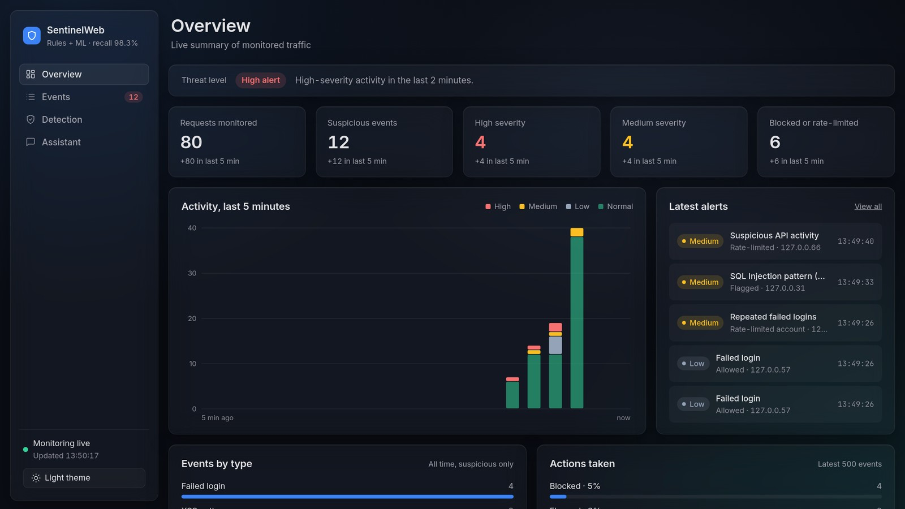
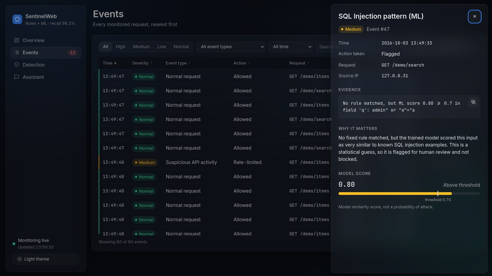
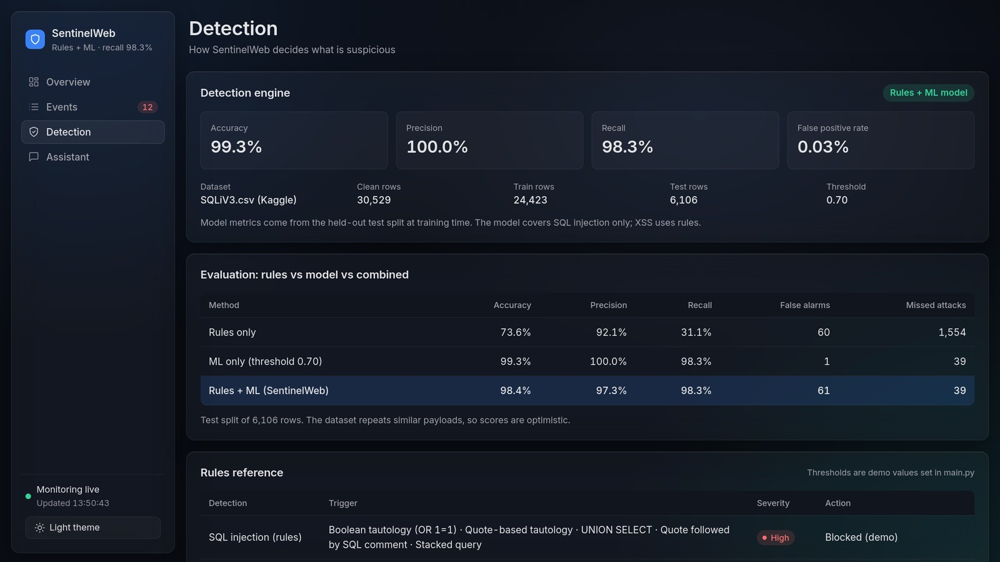
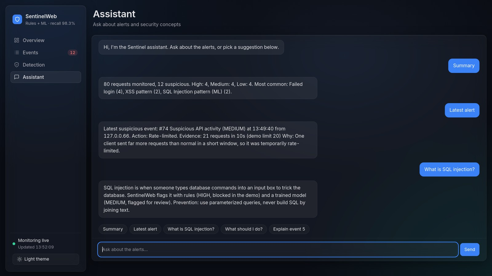
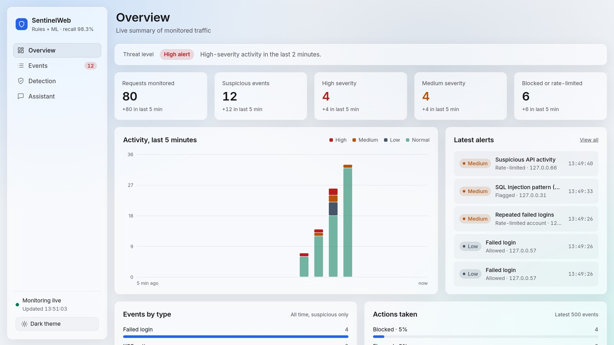

# SentinelWeb (educational prototype)

Monitors requests to a demo app, flags suspicious patterns with rules + a trained model,
and shows them on a dashboard. Use only on your own local demo. Never test sites you do not own.

## Screenshots

**Overview**: threat level, live counters, activity over the last 5 minutes and the latest alerts.

**Event details**: evidence, a plain-language explanation and the ML score against the 0.70 threshold.

**Detection**: live model metrics, rules vs ML vs combined, and every rule with its severity and action.

**Assistant**: answers about the alerts from rules first, with an optional free AI model.

**Light theme**: switch with the button in the sidebar; the choice is remembered.

## Run it

You need **Python 3.10 or newer**. Every step below uses a virtual environment (`venv`), so nothing
is installed system-wide. Always run `train_model.py` once: a model saved with a different
scikit-learn version may not load. If the model is missing, SentinelWeb still runs with rules only.

### Linux (Ubuntu / Debian)

    sudo apt install python3 python3-venv python3-pip     # once, if not installed
    git clone https://github.com/HARISH-prog-dotcom/Sentinal-web.git
    cd Sentinal-web
    python3 -m venv venv
    source venv/bin/activate
    pip install -r requirements.txt
    python train_model.py        # rebuilds models/sqli_model.joblib on YOUR machine (takes ~5 s)
    python evaluate.py           # writes results.md (rules vs ML vs combined)
    uvicorn main:app --reload

Open http://127.0.0.1:8000, then in a second terminal:

    cd Sentinal-web
    source venv/bin/activate
    python simulate.py

### Windows (PowerShell)

Install Python from https://www.python.org/downloads/ and tick **"Add python.exe to PATH"** in the installer.

    git clone https://github.com/HARISH-prog-dotcom/Sentinal-web.git
    cd Sentinal-web
    py -m venv venv
    .\venv\Scripts\Activate.ps1
    pip install -r requirements.txt
    python train_model.py
    python evaluate.py
    uvicorn main:app --reload

If PowerShell says running scripts is disabled, run this once in that window and activate again:

    Set-ExecutionPolicy -Scope Process -ExecutionPolicy Bypass

In Command Prompt (cmd) use `venv\Scripts\activate.bat` instead of `Activate.ps1`.
No Git? Download the repository as a ZIP from GitHub (Code > Download ZIP), unzip it and `cd` into the folder.

Open http://127.0.0.1:8000, then in a second PowerShell window:

    cd Sentinal-web
    .\venv\Scripts\Activate.ps1
    python simulate.py

### macOS

    git clone https://github.com/HARISH-prog-dotcom/Sentinal-web.git
    cd Sentinal-web
    python3 -m venv venv
    source venv/bin/activate
    pip install -r requirements.txt
    python train_model.py
    python evaluate.py
    uvicorn main:app --reload

Then `python simulate.py` in a second terminal (same folder, venv active).

### Open the dashboard from another device

By default the server only accepts connections from the same machine. To open it from a phone or
another computer on the same network, start it with:

    uvicorn main:app --reload --host 0.0.0.0 --port 8000

and open `http://<this-machine's-IP>:8000` (find the IP with `hostname -I` on Linux or `ipconfig` on Windows).
On Windows, allow Python through the firewall when asked; on Linux with ufw, run `sudo ufw allow 8000`.
Anyone on that network can then open the dashboard and clear the event log, so only do this on a network you trust.

### Troubleshooting

- `python: command not found` on Linux outside the venv: use `python3`, or activate the venv first.
- `The virtual environment was not created successfully because ensurepip is not available`:
  run `sudo apt install python3-venv` (on Ubuntu 22.04 the package may be `python3.10-venv`), then create the venv again.
- `ImportError: cannot import name 'ServerProtocol' from 'websockets.server'`: packages were installed
  system-wide and uvicorn picked up Ubuntu's old websockets package. Use the venv steps above,
  or start the server with `uvicorn main:app --reload --ws none`.
- The ML model fails to load: run `python train_model.py` again in the same environment.

## How detection works
- SQL injection: fixed rules (HIGH, blocked in demo) + ML model trained on SQLiV3.csv.
  If only the model flags an input, it is MEDIUM, "Flagged", and never auto-blocked.
- XSS: rules only (the SQLi dataset does not cover XSS).
- Failed logins and request rate: sliding-window counters.

## Files
- main.py, detection.py, db.py, static/index.html - app, rules, storage, dashboard
- ml.py            - loads the model, scores text (threshold set at top)
- train_model.py   - cleans data/SQLiV3.csv, trains and saves the model + metrics
- evaluate.py      - compares rules / ML / combined on a held-out test split
- simulate.py      - safe test scenarios

## Dataset
data/SQLiV3.csv from Kaggle (SQLi dataset). Check and cite the dataset's license/author in your slides.
Cleaning: ~390 rows had shifted columns or conflicting labels and are dropped (30,919 -> 30,529).

## Threshold choice (test split, 6,106 rows)
| Threshold | Recall | False alarms |
|---|---|---|
| 0.5 | 98.8% | 1 |
| 0.7 (used) | 98.3% | 1 |
| 0.9 | 93.7% | 0 |

## Optional: AI answers in the chatbot (free key)
The chatbot answers from rules first. Only when no rule matches does it ask a free AI model.
1. Get a free key: Google AI Studio (aistudio.google.com, "Get API key") or Groq (console.groq.com, "API Keys").
2. In the project folder: `cp .env.example .env` (Windows: `copy .env.example .env`),
   then open `.env` (e.g. `nano .env`, or `notepad .env` on Windows) and paste your key.
3. Restart the server (changes to .env are not picked up by --reload).
4. `.env` is listed in .gitignore. Never upload it to GitHub or share it.
Without a key, the chatbot still works with rules only.
Only summary numbers are sent to the AI service, never IPs, evidence text, or logs.