# SentinelWeb design

Diagrams for both products: **SentinelWeb** (the dashboard, `dashboard/`) and **SentinelWeb Lab** (the client, `client/`).
How to view, edit and re-render them is also summarised in the main README: [Design diagrams](../../README.md#design-diagrams).

Each diagram's source is a [Mermaid](https://mermaid.js.org/) text file in [`diagrams/`](diagrams/), grouped by diagram type.
GitHub renders `.mmd` files directly; edit the text to change a diagram. [`images/`](images/) has the same folders with the
rendered `.png` (for slides and documents) and `.svg` (for the web).

| Folder | Diagram type | Files |
|---|---|---|
| [`architecture/`](diagrams/architecture/) | Component, deployment and module structure | `architecture`, `deployment`, `frontend-modules` |
| [`class/`](diagrams/class/) | UML class diagrams | `dashboard-classes`, `lab-classes` |
| [`sequence/`](diagrams/sequence/) | UML sequence diagrams (function calls over time) | `request-monitoring`, `lab-run-scenario`, `chat-ai-fallback`, `save-ai-key`, `custom-scenario` |
| [`flow/`](diagrams/flow/) | Activity / flowchart | `detection-flow` |
| [`functional/`](diagrams/functional/) | Use cases (who does what) | `use-cases` |
| [`data/`](diagrams/data/) | Entity-relationship (stored data) | `data-model` |
| [`state/`](diagrams/state/) | State machine | `rate-limit` |

| # | Diagram | Type | Answers the question |
|---|---|---|---|
| 1 | [System architecture](#1-system-architecture) | Component | What are the parts and how do they talk? |
| 2 | [Deployment](#2-deployment-docker) | Deployment | How does it run with Docker? |
| 3 | [Use cases](#3-use-cases-functional-view) | Functional | Who does what with each product? |
| 4 | [Detection pipeline](#4-detection-pipeline) | Activity / flowchart | What happens to one request? |
| 5 | [Dashboard classes](#5-dashboard-classes) | Class | How is the backend code organised? |
| 6 | [Lab classes](#6-lab-classes) | Class | How is the client code organised? |
| 7 | [Request monitoring](#7-sequence-monitoring-one-request) | Sequence | Which functions run for one request? |
| 8 | [Lab runs a scenario](#8-sequence-the-lab-runs-a-scenario) | Sequence | How does a Lab result get its verdict? |
| 9 | [Chat with AI fallback](#9-sequence-chat-with-ai-fallback) | Sequence | When does the AI answer? |
| 10 | [Saving an AI key](#10-sequence-saving-an-ai-key) | Sequence | How do Settings page keys and `.env` work together? |
| 11 | [Creating a custom scenario](#11-sequence-creating-a-custom-scenario) | Sequence | How are custom scenarios validated and stored? |
| 12 | [Data model](#12-data-model) | Entity-relationship | What is stored, and where? |
| 13 | [Rate-limit states](#13-rate-limit-states) | State | When is a client or account locked? |
| 14 | [Front-end modules](#14-front-end-modules) | Module dependency | How are the two UIs split into files? |

## Design patterns at a glance

| Pattern | Where | Why |
|---|---|---|
| Application factory + dependency injection | `dashboard/app.py`, `client/app.py` (`create_app`) | Components are created once and passed in; nothing is global, so parts can be tested or swapped |
| Strategy | `detection/detectors.py` (`Detector`), `assistant/llm_providers.py` (`LlmProvider`) | Add a new attack detector or AI provider by adding one class |
| Repository | `storage/event_repository.py` | The rest of the app never writes SQL; storage could change without touching it |
| Facade | `assistant/chat_assistant.py` | One `reply()` hides rules, settings, quota and providers |
| Pipeline (chain of checks) | `monitoring/middleware.py` | The four checks run in a fixed order and each can stop the request |
| Adapter / gateway | `client/services/sentinel_gateway.py` | The only Lab code that speaks HTTP to SentinelWeb |
| Registry | `client/scenarios/registry.py` | Scenarios from built-in, pack and custom files behind one interface |
| Observer | `dashboard/web/js/core/store.js` | UI views re-render when shared state changes |

## 1. System architecture
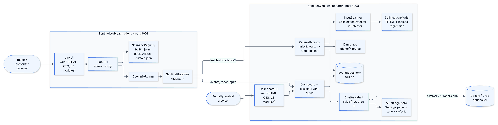
The Lab sends test traffic to `/demo/*` and reads results from `/api/*`. In SentinelWeb, `RequestMonitor` runs
every monitored request through the detectors, logs an event, and only then lets the demo app answer.
Source: [architecture.mmd](diagrams/architecture/architecture.mmd)

## 2. Deployment (Docker)
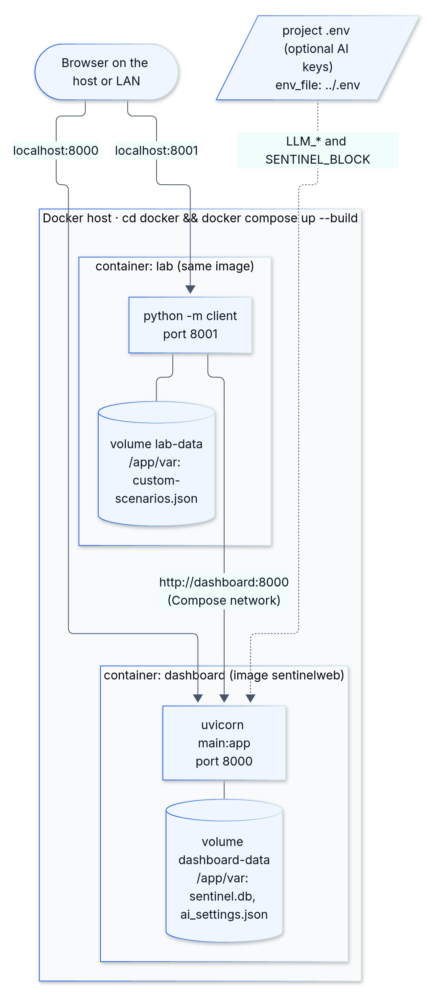
`cd docker && docker compose up --build` starts two containers from one image (built from the project folder).
Each keeps its runtime data in a volume; the optional AI keys come from the project's `.env` (`env_file: ../.env`)
and are never copied into the image.
Source: [deployment.mmd](diagrams/architecture/deployment.mmd)

## 3. Use cases (functional view)
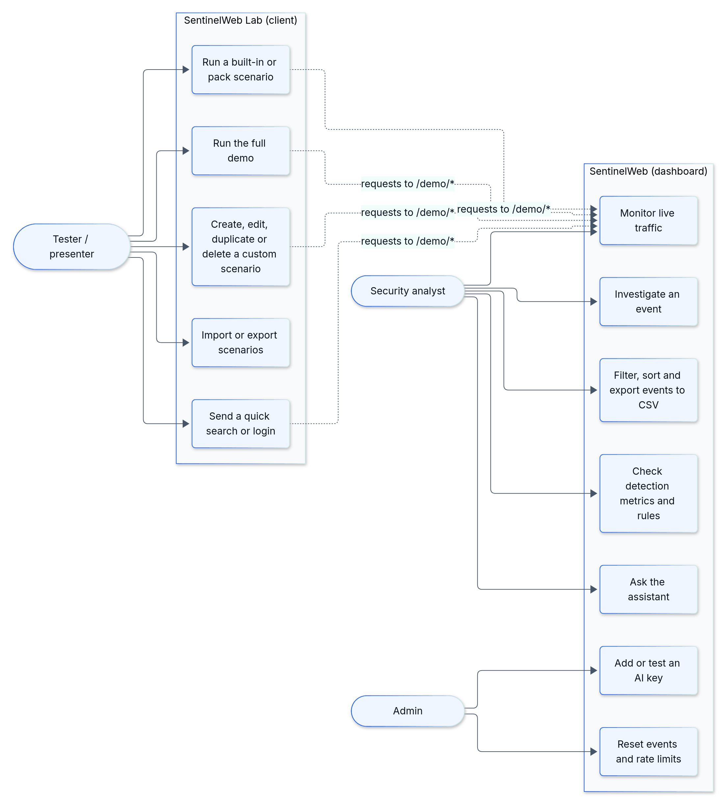
Analysts and admins use the dashboard; testers and presenters use the Lab, whose actions become monitored traffic.
Source: [use-cases.mmd](diagrams/functional/use-cases.mmd)

## 4. Detection pipeline
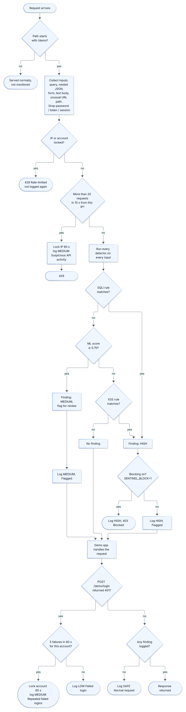
Locked clients are rejected first (and not logged again), floods are caught before the more expensive input scan,
and failed logins are counted last because they need the demo app's response.
Source: [detection-flow.mmd](diagrams/flow/detection-flow.mmd)

## 5. Dashboard classes
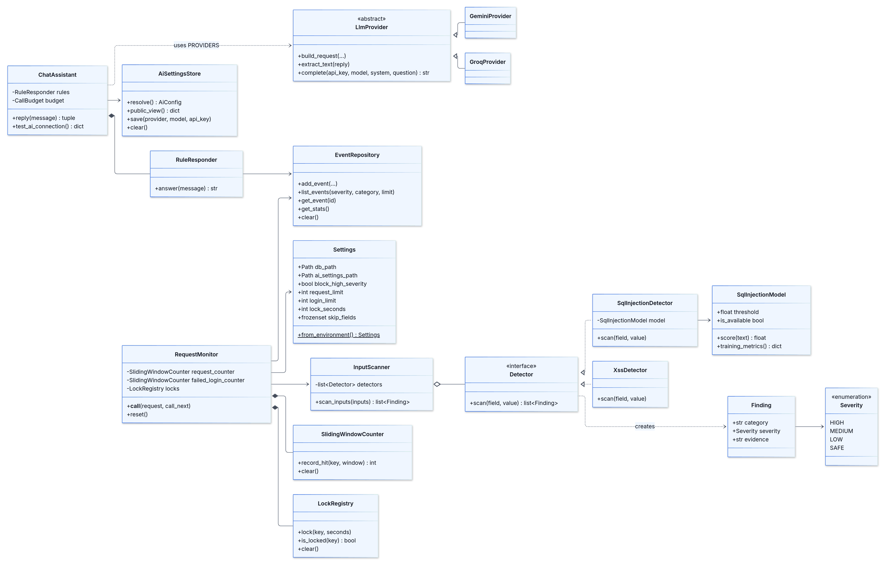
Source: [dashboard-classes.mmd](diagrams/class/dashboard-classes.mmd)

## 6. Lab classes
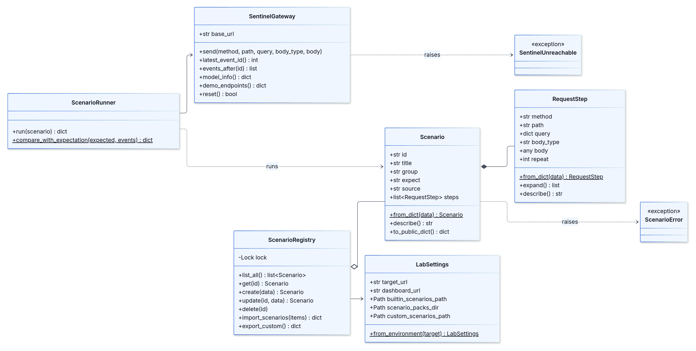
Source: [lab-classes.mmd](diagrams/class/lab-classes.mmd)

## 7. Sequence: monitoring one request
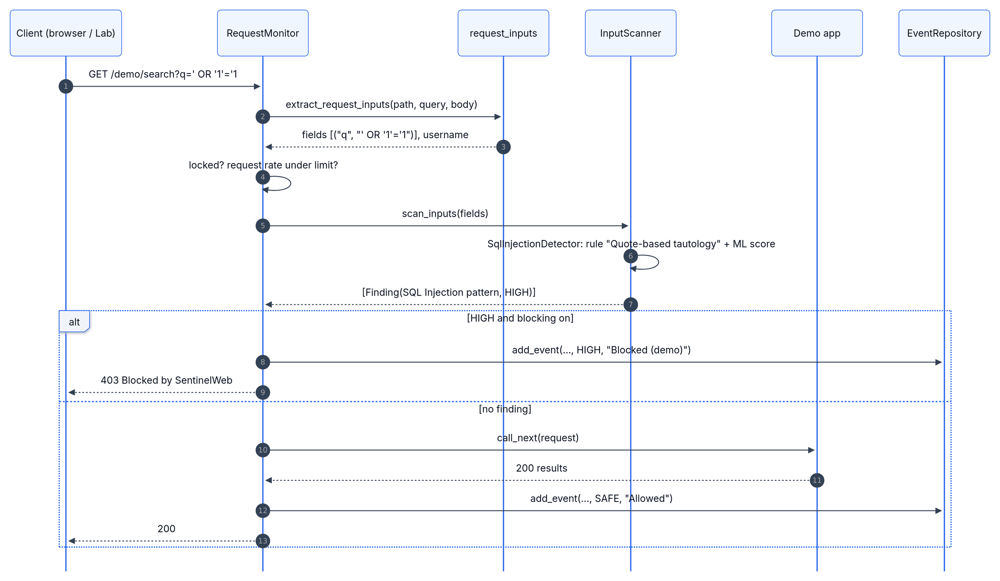
Source: [request-monitoring.mmd](diagrams/sequence/request-monitoring.mmd)

## 8. Sequence: the Lab runs a scenario
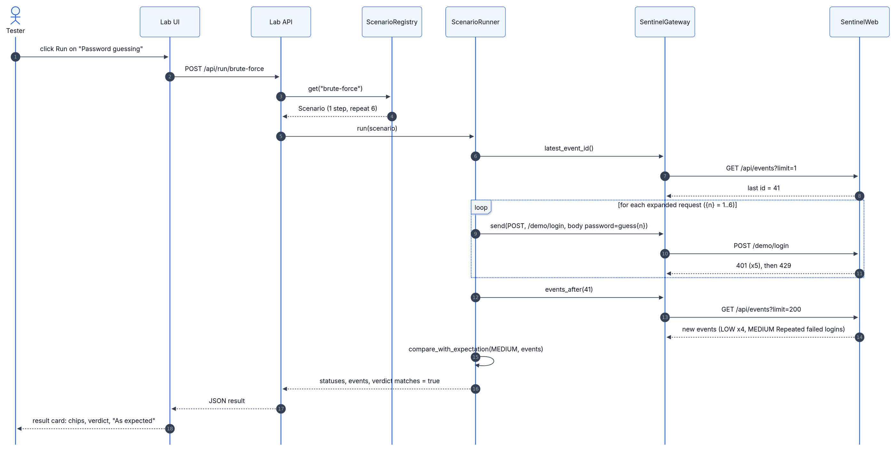
The runner remembers the newest event id before sending, so it can collect exactly the events its own requests produced.
Source: [lab-run-scenario.mmd](diagrams/sequence/lab-run-scenario.mmd)

## 9. Sequence: chat with AI fallback
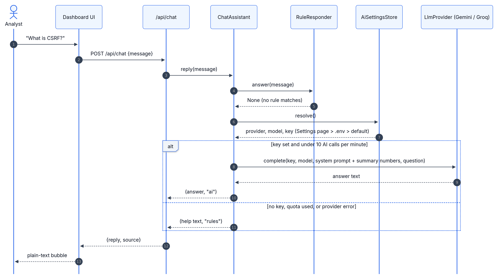
Source: [chat-ai-fallback.mmd](diagrams/sequence/chat-ai-fallback.mmd)

## 10. Sequence: saving an AI key
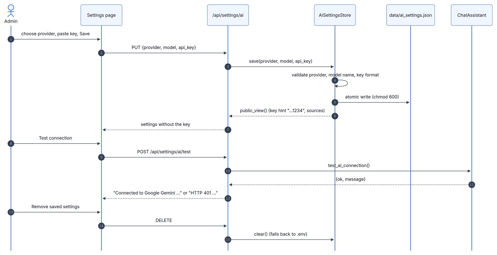
For each setting the dashboard uses: saved on the Settings page → `.env` / environment → default.
Source: [save-ai-key.mmd](diagrams/sequence/save-ai-key.mmd)

## 11. Sequence: creating a custom scenario
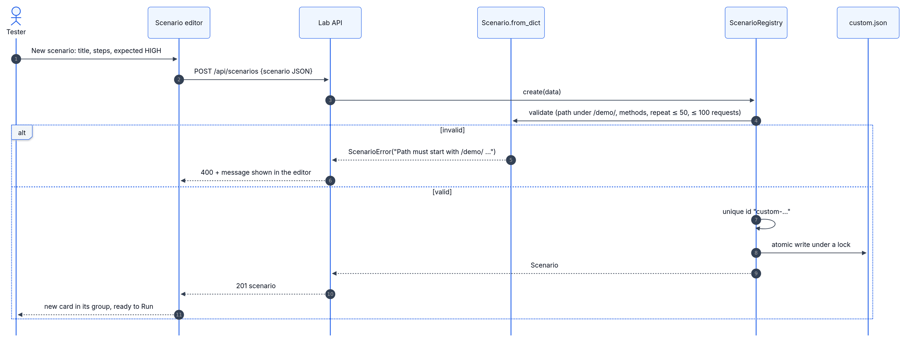
Source: [custom-scenario.mmd](diagrams/sequence/custom-scenario.mmd)

## 12. Data model
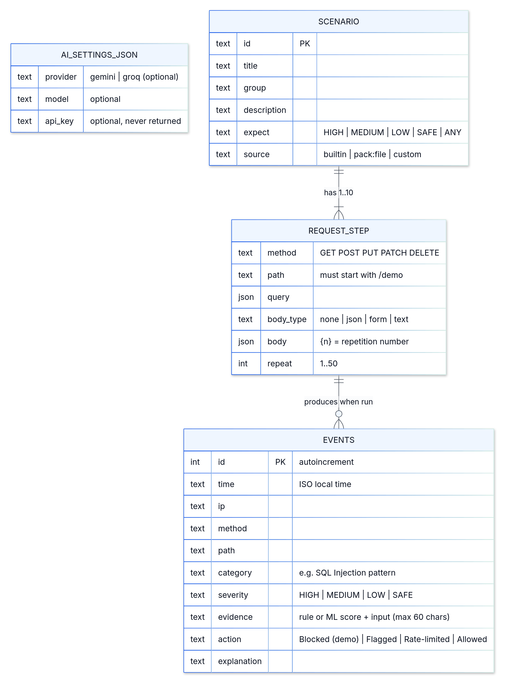
Events live in SQLite (`data/sentinel.db`); saved AI settings in `data/ai_settings.json`; scenarios in JSON files
(`client/scenarios/builtin.json`, `packs/*.json`, `custom.json`).
Source: [data-model.mmd](diagrams/data/data-model.mmd)

## 13. Rate-limit states
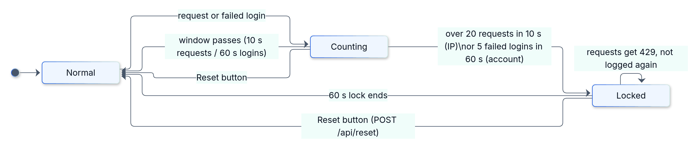
Source: [rate-limit.mmd](diagrams/state/rate-limit.mmd)

## 14. Front-end modules
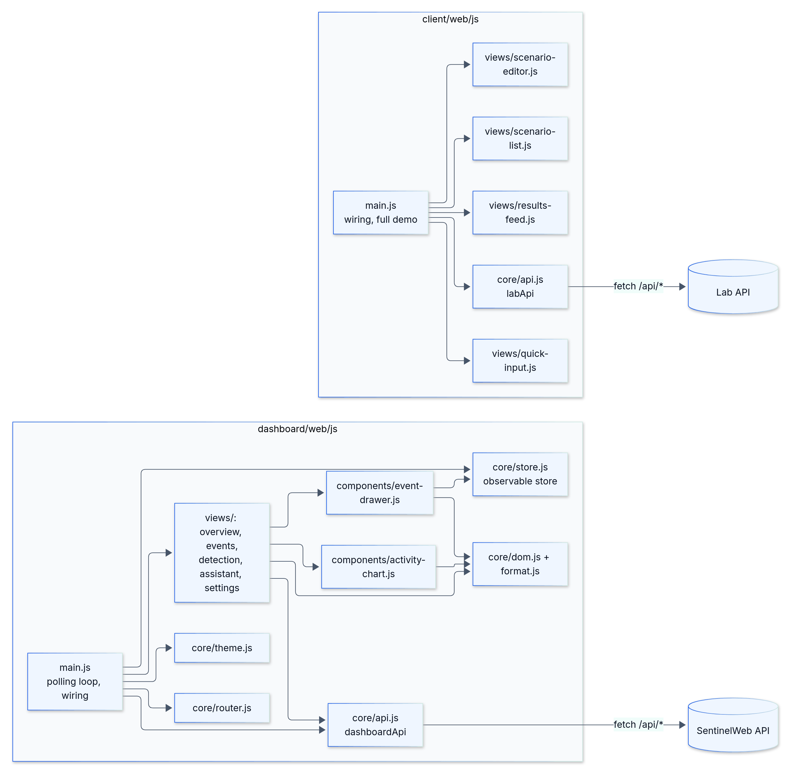
Both UIs are plain ES modules (no build step). Only `core/api.js` talks to the server, and every value from the
server is rendered as text, never as HTML, because logged input can contain attack strings.
Source: [frontend-modules.mmd](diagrams/architecture/frontend-modules.mmd)

## Viewing, editing and re-rendering

- **View:** open this page on GitHub, or the `.png`/`.svg` files in `images/<type>/`.
- **Edit:** change the `.mmd` text in `diagrams/<type>/`. Preview while editing with the Mermaid Live Editor
  (https://mermaid.live) or a Mermaid extension for VS Code.
- **Re-render one diagram** (needs Node.js; run from `docs/design`):

      npx -p @mermaid-js/mermaid-cli mmdc -i diagrams/class/lab-classes.mmd -o images/class/lab-classes.svg
      npx -p @mermaid-js/mermaid-cli mmdc -i diagrams/class/lab-classes.mmd -o images/class/lab-classes.png -s 2

- **Re-render all of them** (Linux/macOS):

      for f in diagrams/*/*.mmd; do out="images/${f#diagrams/}"; npx -p @mermaid-js/mermaid-cli mmdc -i "$f" -o "${out%.mmd}.svg"; npx -p @mermaid-js/mermaid-cli mmdc -i "$f" -o "${out%.mmd}.png" -s 2; done

  To add a new diagram, put its `.mmd` in the folder for its type and render it into the matching `images/` folder.
