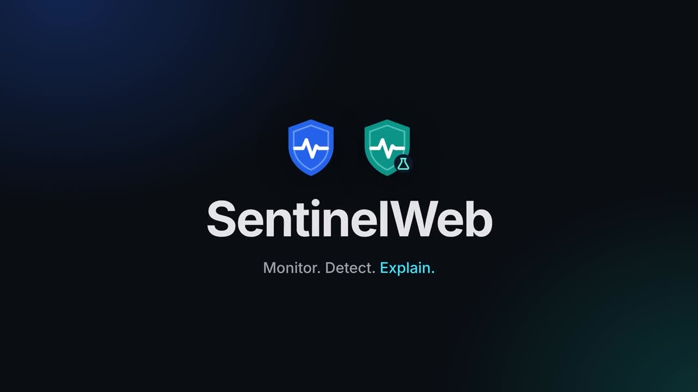

# SentinelWeb demo video

**[sentinelweb-demo.mp4](sentinelweb-demo.mp4)**: 42 seconds, 1920×1080, 30 fps, H.264 + AAC, about 12 MB.
A short product ad for both products, suitable for a README, a slide or social media. It has no voice-over,
so it works muted; the soft ambient soundtrack was generated from pure tones (no third-party music, no licence needed).

| Time | Scene | Message |
|---|---|---|
| 0:00 | Logos | SentinelWeb · Monitor. Detect. Explain. |
| 0:03 | The problem | SQL injection, XSS, brute force, floods; logs alone don't explain what happened |
| 0:07 | Two products | SentinelWeb Lab sends safe test traffic; SentinelWeb catches it and explains why |
| 0:10 | Lab | Run real attack scenarios, safely |
| 0:14 | Verdict | Every request classified ✓ as expected |
| 0:18 | Dashboard | Watch attacks arrive live |
| 0:21 | Event details | Evidence, reason and ML score for every alert |
| 0:25 | Results | Recall 31% (rules) → 98% (rules + ML) |
| 0:29 | Scenario editor | Build, save and share your own scenarios |
| 0:32 | Settings | Add an AI key in the dashboard, or keep using .env |
| 0:36 | Docker | `cd docker` + `docker compose up --build` |
| 0:39 | Outro | Logos and repository link |

All footage is real: screenshots of SentinelWeb and SentinelWeb Lab running against each other with test traffic
(the API key shown on the Settings page is a dummy). Scenes were laid out as HTML at 4K, rendered with headless
Chromium, and assembled with ffmpeg (slow zoom per scene, 0.6 s crossfades).
